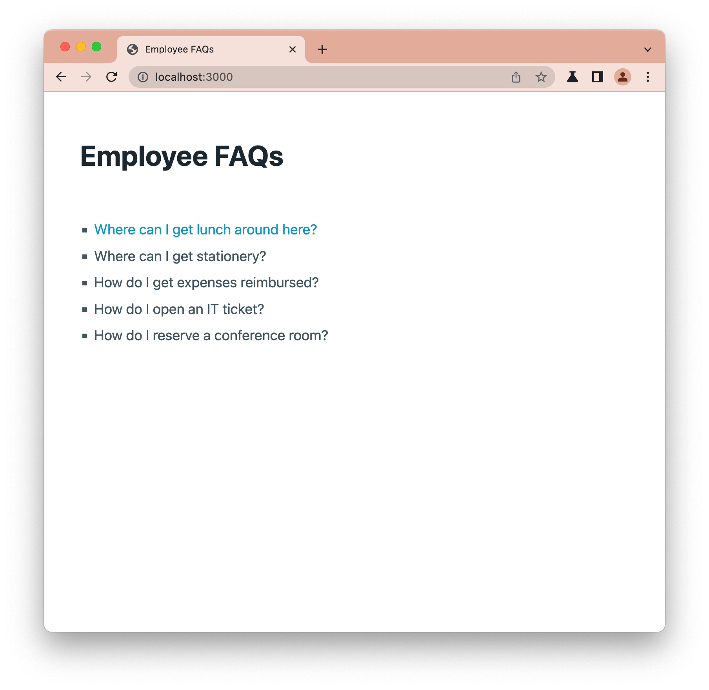
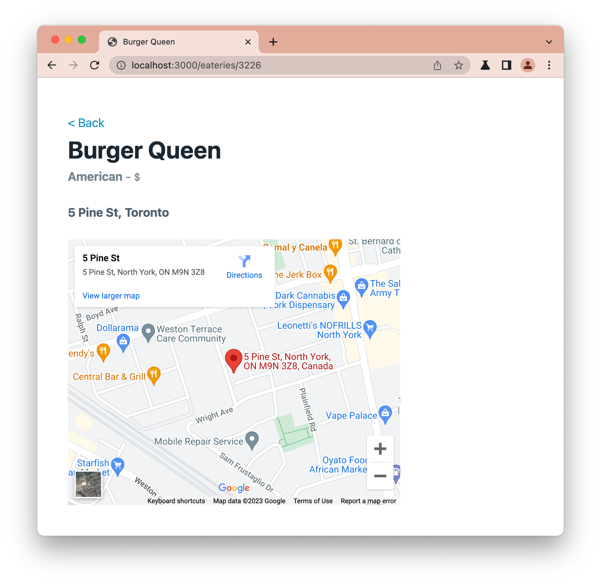
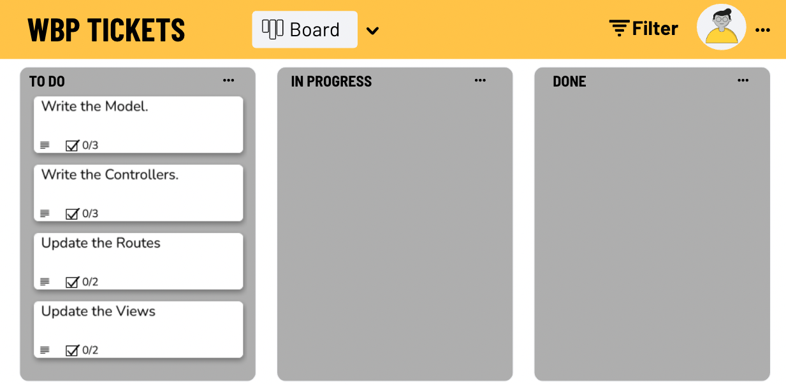

# Express Routers & Controllers WBP


It's only your first week at your new programming job, and you're just starting to get your bearings around the office. Pretty soon it's lunch time, and your stomach starts to rumble.

You ask your ever-helpful office manager: "Are there any good places to grab lunch around here?"

_"Of course! In fact, the Employee Wellbeing Committee (which I lead) is starting an intranet site to keep track of a list of Employee Frequently Asked Questions (FAQs) -- your question happens to be the first question we're working on. Actually I'm learning how to program and writing all this stuff up in a little Express app right here!"_



_"I only just got started on the app though, so I've only done the 'Where can I get lunch around here?' question and put three places on it so far."_


_"I like Burger Queen myself, it's just around the corner. Look, it's even got a Google Map!"_



Impressed that your office manager is learning how to program, you say "Thanks so much!" and prepare to leave for lunch, but your office manager keeps talking:

_"That's the mission of the Employee Wellbeing Committee, by the way -- in our spare time we all pitch in to make everyone's life better around the office... That reminds me, you're the new programming whiz, right? You're just the person I need."_

_"See, right now I have each eatery on a separate page. But it's getting to be annoying manually writing a new page for each eatery every time I want to add one, and manually updating the index page."_

_"But I heard that it's possible to DRY my code by using Models, Controllers, and Views. Actually, do you think you can help me with that?"_

Sighing, you promise you'll help... right after lunch.

_"Welcome to the Employee Wellbeing Committee!!!"_, your office manager hollers as you run out the door to Burger Queen, and you wonder what you've gotten yourself into.

---


* Writing models
* Writing controllers
* Wrtiing dynamic routes
* Writing `.ejs` view templates

---


<!-- [Trello Board](https://trello.com/b/zhaJvdZB/express-routers-controllers) -->



---


#### Step 1:

- Fork and clone [this](https://git.generalassemb.ly/SEI-Standard-Curriculum/M2L4-express-routers-controllers-wbp) repository
- Navigate (`cd`) into the repository folder in your console
  - Run the command `npm install` -- this will install the modules necessary for the automated tests to run
- Open up the repository folder in your code editor
  - If you're using Visual Studio Code, the command is `code .`
- Run the app with `nodemon`
  - Navigate to `localhost:3000` and you'll see that it's already working
  - Click around a bit to look at the various lunch places around the office
- Read through the following files:
  - `routes/eateries.js`
  - `views/eateries/list.ejs`
  - `views/eateries/3226.ejs`
  - `views/eateries/5475.ejs`
  - `views/eateries/9567.ejs`
- The files are full of repetitious code. Use what you've learned about Models, Views, and Controllers to simplify the app!

#### Step 2:

- The first step is to write the **Model**
- Create an appropriately named file in the `models` directory
  - Is it supposed to be named singular or plural? Uh-oh, better check your course notes!
- Using what you've learned in class, write the `getAll()` and `getOne()` functions
  - Be sure to export them!
- **Hint**: Remember that you'll need an array of the various eatery data. To help you with saving some typing, here's a ready made one that you can copy & paste:

```js
[
  {
    id: 3226,
    name: 'Burger Queen',
    genre: 'American',
    address: '5 Pine St, Toronto',
    price: '$'
  },
  {
    id: 5475,
    name: 'Sushi King',
    genre: 'Japanese',
    address: '11 Maple Blvd, Toronto',
    price: '$$$'
  },
  {
    id: 9567,
    name: 'West Side Marios',
    genre: 'Italian',
    address: '43 Elm Ave, Toronto',
    price: '$$$'
  }
];
```

- To check that you did everything right, run: `npm test test/models`

#### Step 3:

- The next step is to write the **Controller**
- Create an appropriately named file in the `controllers` directory
  - Is it supposed to be named singular or plural? Ugh. Better check your course notes again!
- Using what you've learned in class, write the `index()` and `show()` functions
  - Be sure to export them!
- **Hint**: You'll need to use the **Model** that you wrote earlier
- To check that you did everything right, run: `npm test test/controllers`

#### Step 4:

- Next, you'll have to update the **Views**
- open up the four eatery view files:
  - `eateries/list.ejs`
  - `eateries/3226.ejs`
  - `eateries/5475.ejs`
  - `eateries/9567.ejs`
- Your job is to use what you've learned to condense all of that into **two** appropriately named files
  - What should they be called again!? Check your notes!
- **Hint**: You'll have to remove all the hardcoded data from these files and use alligator tags (`<%`, `<%=` and `%>`) to insert those values into the template instead
- To check that you did everything right, run: `npm test test/views`

#### Step 5:

- The final step is to update the **Routes**
- Open up the `routes/eateries.js` file
- Notice that there are four routes currently, one for the list of eateries, and one for each eatery
- Using what you've learned in class, reduce this to **two** routes only
  - Remember route parameters using `:id`? No? Better check your course notes!
- **Hint**: You'll have to use the **Controller** and the filenames of the **Views** that you wrote earlier
- To check that you did everything right, run: `npm test test/routes`

## The End

- Be sure the user interface of your app is working by checking `localhost:3000` and clicking through all the links
- Run all the tests all together with `npm test`
- You're done if everything is passing!
